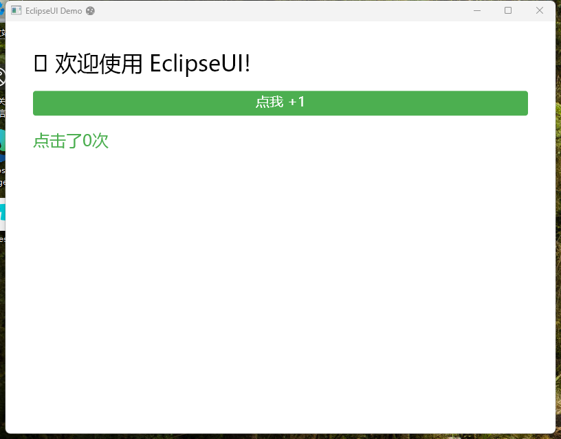

# 🌑 EclipseUI

> **基于 Blazor + SkiaSharp 的跨平台 UI 框架**

EclipseUI 是一个使用 **Razor 语法**描述界面，通过 **SkiaSharp** 进行自绘渲染的跨平台 UI 框架。基于 Blazor 组件模型，从渲染引擎到布局系统，从控件库到窗口管理，全部独立实现。

> ⚠️ **实验性项目** - 本项目通过 [OpenClaw](https://github.com/openclaw/openclaw) 开发，旨在验证 OpenClaw 框架的 AI 辅助开发能力。**本项目仅供学习和研究使用，不建议用于生产环境或商业用途。**

[](LICENSE)
[](https://github.com/CeSun/EclipseUI)

---

## 🎯 项目定位

EclipseUI 提供一个轻量级的跨平台 UI 解决方案：

- ✅ **Razor 语法** - 使用熟悉的 Blazor 语法描述 UI
- ✅ **SkiaSharp 自绘** - 跨平台 2D 图形库，像素级控制
- ✅ **无 UI 框架依赖** - 不依赖 Avalonia、MAUI 等现有 UI 框架
- ✅ **跨平台一致性** - Windows/Linux/macOS 像素级一致表现
- ✅ **轻量级** - 最小依赖，快速启动

---

## 🌰 快速示例

```razor
<StackPanel Orientation="Vertical" Spacing="20">
    <TextBlock Text="🌑 欢迎使用 EclipseUI!" FontSize="32" />
    
    <Button Text="点我" OnClick="OnClick" Background="#4CAF50" />
    
    <TextBlock Text="点击了 @_count 次" FontSize="18" />
</StackPanel>

@code {
    int _count = 0;
    
    void OnClick(MouseEventArgs e)
    {
        _count++;
        StateHasChanged();
    }
}
```

---

## 📸 运行截图



*EclipseUI Demo 应用 - 展示 StackPanel 布局、TextBlock 文本显示和 Button 按钮控件*

---

## 🏗️ 架构设计

```
┌─────────────────────────────────────────┐
│           Razor 组件 (.razor)           │
│   (使用 Blazor 语法描述 UI)               │
└─────────────────────────────────────────┘
                    ↓
┌─────────────────────────────────────────┐
│       Blazor 渲染树 (RenderTree)        │
└─────────────────────────────────────────┘
                    ↓
┌─────────────────────────────────────────┐
│         EclipseRenderer                 │
│   (继承 Blazor Renderer，管理渲染生命周期) │
└─────────────────────────────────────────┘
                    ↓
┌─────────────────────────────────────────┐
│    EclipseComponentAdapter              │
│   (将 RenderTree 转换为 EclipseElement 树) │
└─────────────────────────────────────────┘
                    ↓
┌─────────────────────────────────────────┐
│         EclipseElement 树               │
│   (StackPanel, TextBlock, Button...)    │
└─────────────────────────────────────────┘
                    ↓
┌─────────────────────────────────────────┐
│    SkiaSharp + OpenGL 绘制              │
│   (GRContext → SKSurface → GL)          │
└─────────────────────────────────────────┘
```

---

## 🚀 快速开始

### 环境要求

- .NET 8.0 或更高版本
- 支持 OpenGL 3.0+ / DirectX 11+ 的显卡

### 运行示例

```bash
cd samples/EclipseUI.Demo
dotnet run
```

### 项目结构

```
EclipseUI/
├── src/EclipseUI/              # 核心库
│   ├── Core/                   # 渲染器、组件基类、元素基类
│   ├── Layout/                 # 布局容器（StackPanel 等）
│   └── Controls/               # 基础控件（TextBlock, Button 等）
├── src/EclipseUI.Host/         # 窗口宿主（Silk.NET）
├── samples/EclipseUI.Demo/     # 演示应用
└── docs/                       # 文档
    ├── FEATURES.md             # 功能文档
    ├── ROADMAP.md              # 开发路线图
    └── guidelines/             # 开发规范
```

---

## 📦 核心组件

### 布局控件

| 控件 | 说明 |
|------|------|
| `<StackPanel>` | 水平/垂直堆叠布局 |
| `<Grid>` | 网格布局（计划中） |
| `<WrapPanel>` | 自动换行布局（计划中） |

### 基础控件

| 控件 | 说明 |
|------|------|
| `<TextBlock>` | 文本显示 |
| `<Button>` | 按钮 |
| `<Image>` | 图片（计划中） |
| `<TextBox>` | 文本输入（计划中） |

---

## 🎯 技术特点

### 与现有框架的对比

| 特性 | EclipseUI | MAUI | Avalonia | Uno Platform |
|------|-----------|------|----------|--------------|
| UI 描述 | Razor | XAML/C# | XAML | XAML/WinUI |
| 渲染引擎 | SkiaSharp (自绘) | 原生控件 | SkiaSharp (自绘) | SkiaSharp/Wasm/原生 |
| 跨平台 | Windows/Linux/macOS | 多平台 | 多平台 | 多平台 |
| 一致性 | 像素级一致 | 依赖平台 | 像素级一致 | 依赖平台 |
| 组件模型 | Blazor | MVVM | MVVM | MVVM |
| 学习曲线 | 低 (Web 背景) | 中 | 中 | 中 |
| 包大小 | 小 | 大 | 中 | 大 |
| 当前状态 | 早期开发 | 成熟 | 成熟 | 成熟 |

### 技术栈

- **.NET 8.0** - 运行时
- **SkiaSharp** - 2D 图形渲染
- **Silk.NET** - 跨平台窗口管理（基于 GLFW）
- **Blazor** - 组件模型和渲染树
- **OpenGL/DirectX** - GPU 加速（通过 SkiaSharp）

---

## 📝 开发路线

详细规划请参阅 [ROADMAP.md](docs/ROADMAP.md)

### 已完成 ✅

- [x] 核心渲染引擎（EclipseRenderer）
- [x] 组件模型（EclipseComponentBase）
- [x] 元素系统（EclipseElement）
- [x] StackPanel 布局
- [x] TextBlock 控件
- [x] Button 控件
- [x] 事件处理系统
- [x] 窗口宿主（Silk.NET）

### 计划中 📋

**Phase 1 - 布局完善**
- [ ] Grid 网格布局
- [ ] WrapPanel 自动换行
- [ ] DockPanel 停靠布局

**Phase 2 - 输入控件**
- [ ] TextBox 文本输入
- [ ] TextEditor 多行编辑
- [ ] NumberBox 数字输入
- [ ] ComboBox 下拉选择

**Phase 3-6 - 更多功能**
- [ ] 选择控件（CheckBox, RadioButton, Slider）
- [ ] 高级控件（Image, Border, ProgressBar, ListBox）
- [ ] 容器控件（ScrollViewer, TabControl, Expander）
- [ ] 高级特性（样式、数据绑定、动画、主题）

---

## 🤝 贡献

欢迎贡献代码！

1. Fork 本仓库
2. 创建特性分支 (`git checkout -b feature/feature-name`)
3. 提交改动 (`git commit -m 'Add some feature'`)
4. 推送到分支 (`git push origin feature/feature-name`)
5. 创建 Pull Request

**开发前请阅读：** [docs/guidelines/development-rules.md](docs/guidelines/development-rules.md)

---

## 📄 许可证

MIT License - 详见 [LICENSE](LICENSE)

---

## 🌟 致谢

- **用户** - 提出需求，给予信任
- [SkiaSharp](https://github.com/mono/SkiaSharp) - 强大的 2D 图形库
- [Silk.NET](https://github.com/dotnet/Silk.NET) - 跨平台窗口管理
- [Blazor](https://dotnet.microsoft.com/apps/aspnet/web-apps/blazor) - 优秀的组件模型

---

**EclipseUI** - 用 Razor 绘制你的世界 🌑

*轻量 · 跨平台 · 像素级控制*
